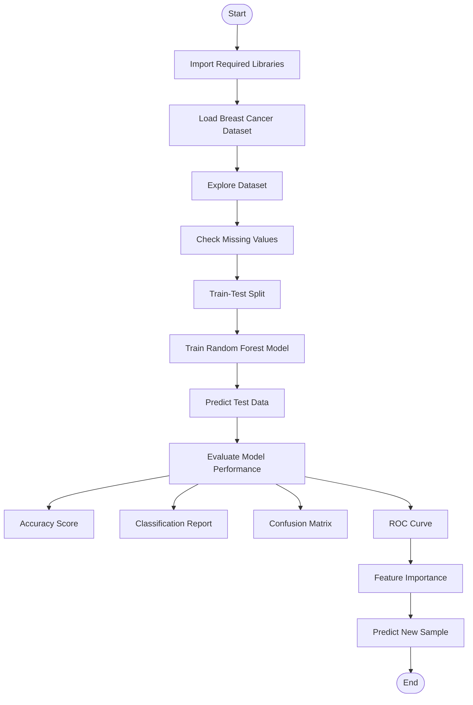

# 🩺 Predictive Modeling Using Machine Learning

> An end-to-end Machine Learning project that predicts breast cancer diagnosis using the **Breast Cancer Wisconsin Dataset** and a **Random Forest Classifier**. This project demonstrates the complete machine learning workflow, from data loading to model evaluation and prediction.


---

# 📌 Project Overview

This project builds a **Machine Learning classification model** using the **Random Forest Algorithm** to classify breast tumors as **Benign** or **Malignant**.

The project follows the complete supervised learning workflow:

- Dataset Loading
- Data Exploration
- Data Preprocessing
- Train-Test Split
- Model Training
- Model Prediction
- Performance Evaluation
- Feature Importance Analysis

---

# 🎯 Objectives

- Load the Breast Cancer Wisconsin Dataset
- Explore and understand the dataset
- Train a Random Forest Classifier
- Predict tumor diagnosis
- Evaluate model performance
- Visualize model results
- Identify important predictive features

---

# 📂 Dataset Information

| Property | Value |
|----------|-------|
| Dataset | Breast Cancer Wisconsin Dataset |
| Source | Scikit-learn |
| Samples | 569 |
| Features | 30 |
| Target | Benign / Malignant |
| Learning Type | Supervised Learning |
| Problem Type | Binary Classification |

---

# 🛠️ Technologies Used

- Python
- Pandas
- NumPy
- Matplotlib
- Seaborn
- Scikit-learn

---

# 🤖 Machine Learning Algorithm

- Random Forest Classifier

---

# 📊 Project Workflow



---

# 📁 Project Structure

```
Predictive-Modeling-Using-Machine-Learning/
│
├── Predictive_Modeling.ipynb
├── predictive_model.py
├── README.md
├── requirements.txt
└── images/
```

---

# 🚀 Installation

Clone the repository

```bash
git clone https://github.com/its-akash-2027/Predictive-Modeling-Using-Machine-Learning.git
```

Go to the project directory

```bash
cd Predictive-Modeling-Using-Machine-Learning
```

Install required libraries

```bash
pip install -r requirements.txt
```

or

```bash
pip install pandas numpy matplotlib seaborn scikit-learn
```

---

# ▶️ Run the Project

Python

```bash
python predictive_model.py
```

or

Open

```
Predictive_Modeling.ipynb
```

using **Jupyter Notebook** or **Google Colab**.

---

# 📈 Model Evaluation

The model is evaluated using the following metrics:

- ✅ Accuracy Score
- ✅ Classification Report
- ✅ Confusion Matrix
- ✅ ROC Curve
- ✅ AUC Score
- ✅ Feature Importance

---

# 📷 Output

The project generates:

- Accuracy Score
- Classification Report
- Confusion Matrix
- ROC Curve
- Feature Importance Chart
- Prediction Result

---

# 📚 Required Libraries

```python
pandas
numpy
matplotlib
seaborn
scikit-learn
```

---

# 🎓 Learning Outcomes

After completing this project, you will understand:

- Supervised Machine Learning
- Binary Classification
- Data Preprocessing
- Feature Engineering
- Random Forest Algorithm
- Model Evaluation
- Confusion Matrix
- ROC Curve
- Feature Importance

---

# 📌 Future Improvements

- Hyperparameter Tuning
- Cross Validation
- Compare Multiple Algorithms
- Model Deployment with Flask/Streamlit
- Interactive Dashboard

---

# 👨‍💻 Author

**Akash V**

🎓 M.Sc. Data Science

💻 Python | Machine Learning | Artificial Intelligence

📊 Passionate about transforming data into intelligent solutions.

